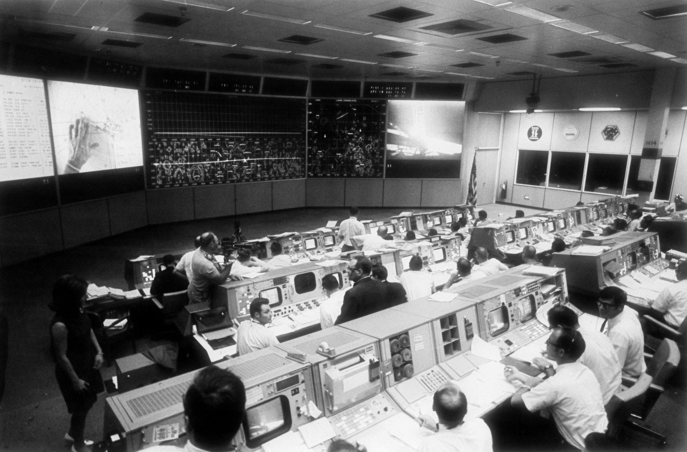
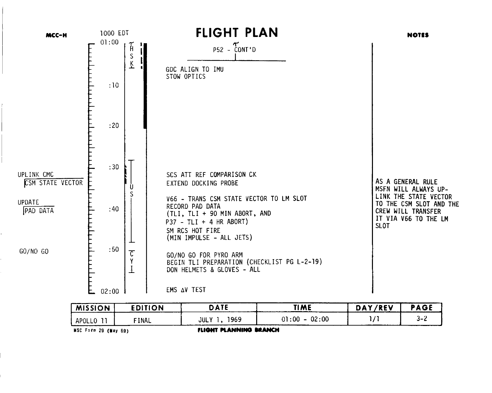

# NASApunk 风格与逐星巡礼的应用建议

调研日期：2026 年 10 月 10 日。

NASApunk 适合作为逐星巡礼的物件、界面与材质方向：技术有可辨认的工程来源，工具留下使用痕迹，人物仍然保有探索太空的愿望。本站已有鸟船、飞行轨迹、地面天线和任务经过时间，可以从这些内容继续发展。

建议时间表偏向任务控制与排程图，鸟船偏向可维护的航天设备，首页保留秘封与星空的浪漫。本文提出的是设计建议，颜色、材质和效果尚未作为网站规范实施。关于素材制作与库的比较，参见[视觉素材与动画效果调研](./visual-materials-and-motion-research.md)。

## NASApunk 的出处与含义

Bethesda 在《Starfield》的开发访谈中，用 NASA-Punk 描述一种建立在现实技术之上、能够推想其未来演变的科幻方向。2022 年 Xbox Wire 刊登了主美术 Istvan Pely 和动画负责人 Rick Vicens 对这个词的解释；它帮助团队形成共同的美术判断。这里采用这一创作者解释，不把该访谈当作词语首次出现的证明。[Xbox Wire 访谈](https://news.xbox.com/fr-fr/2022/02/18/starfield-tentez-de-gagner-une-illustration-signee/)

2023 年 Microsoft 的幕后访谈进一步谈到早期航天的浪漫、熟悉的先进设备，以及带有按钮、开关和生活痕迹的飞船。这些说明给本站一个实用判断：观众应能理解物件怎样工作，也能想象有人在这里生活、操作和维护。[Microsoft 幕后访谈](https://news.microsoft.com/source/features/work-life/behind-the-scenes-of-starfield-where-you-can-explore-a-thousand-new-worlds-among-the-stars/)

NASA-Punk 是创作团队使用的美术概念。NASA 的历史平面规范、真实设备与任务文件，是可以分别研究的参考；它们不组成一份统一的“NASApunk 官方标准”。对本站而言，参考价值在于设计方法和具体细节，现有逐星巡礼品牌与秘封内容继续保留。

## 三类参考各自提供什么

| 参考 | 可以观察的内容 | 在本站的用途 |
| --- | --- | --- |
| Apollo 任务文件与控制面板 | 时间刻度、任务区间、功能分区、标注和边界 | 时间表、操作权限、进度与状态 |
| NASA 历史平面设计 | 字体层级、版式、少量颜色、图像与注释的组织 | 页面标题、说明图、专题封面 |
| Starfield 的 NASApunk 创作 | 现实设备的未来延伸、生活痕迹、人物与探索意象 | 鸟船材质、首页氛围、创作接力的视觉叙事 |

NASA 的 Apollo 图纸资料页收录了舱内结构、主控制面板、导航与姿态控制等图示，可以按功能观察物件。[NASA Apollo 技术图纸](https://www.nasa.gov/history/diagrams/apollo.html)

1976 年《NASA Graphics Standards Manual》在字体章节讨论 Helvetica、Futura 等字体，也在出版物章节说明单色、双色印刷和图像处理方式。借鉴这些组织方法时，需区分机构标志规范与本站的页面设计：现有中文字体、品牌标志和状态颜色都有自己的职责。[NASA 平面设计手册，第 26–28 页](https://www.nasa.gov/wp-content/uploads/2015/01/nasa_graphics_manual_nhb_1430-2_jan_1976.pdf#page=26)

Apollo 控制中心修复资料还记录了控制台、投影设备，以及手册、耳机、咖啡杯等日用品。这些真实细节说明，航天空间同时也是人的工作场所。转化到网站时，作者信息、作品和实际任务应占据明确位置。[NASA 控制中心修复资料](https://www.nasa.gov/johnson/history/apollo-mcc-restoration/)

## 可采用的视觉语言

下面是结合上述参考对本站的归纳，不是通用于所有 NASApunk 作品的固定清单。

| 维度 | 建议采用的细节 | 如何判断是否合适 |
| --- | --- | --- |
| 结构 | 模块面板、连续轴线、接缝、固定件、独立设备区 | 边界能否说明功能与维护关系 |
| 材质 | 哑光漆面、金属、隔热层、橡胶与织物的不同反应 | 相邻部件是否因为材质与用途而有区别 |
| 图形 | 标尺、区间条、引线、编号、轮廓与剖面 | 图形是否解释时间、结构或真实状态 |
| 字体 | 清楚的无衬线正文，等宽数字用于计时和编号 | 作者与操作是否容易阅读，数字是否整齐 |
| 色彩 | 大面积中性基底，少量有意义的状态色 | 颜色能否帮助定位状态与重要动作 |
| 使用痕迹 | 常触碰处的磨损、标签边缘、接缝里的细微积尘 | 痕迹是否与物件使用方式一致 |
| 氛围 | 黑暗太空与局部工作照明，人物与设备之间的尺度差 | 是否同时有工程可信感和探索的吸引力 |

局部使用痕迹能体现物件经历过使用。整面均匀撒噪点、每个模块套同一种金属纹理、所有角落贴装饰编号，会让细节失去出处。先确定部件做什么，再决定它应有什么表面和痕迹。

界面也应按同样的方法设计。比如“已预留”可以表现为区间被暂时占住，“已确认”可以表现为完整填充；选中标记则指出当前正在查看的位置。每种图形都对应一个真实含义。

## 时间表如何体现这个方向

时间表适合参考任务条、排程板和投影叠层：时间轴保持连续，已占用区间有填充，选择指示单独覆盖在上面。半透明处理是本站结合背景图提出的转化方案，不声称是历史 NASA 控制台的统一状态样式。

建议把以下三层分开制作：

1. 时间标尺、作者和操作内容保持清晰、稳定。
2. 占用层持续显示：已预留是浅填充与疏斜线，已确认是更完整的半透明填充，待认领保持空心。
3. 选择层叠加亮边、角标或节点指向，切换时短暂移动，保留底下的占用纹理。

条目的面积与实际布局相适应，优先填充可点击时段区域，不用装饰高度暗示并不存在的作品持续时长。顶部总览和下方条目共享同一套状态语言。

第一版以清楚的静态填充为主。可以再尝试一次从轴线向外展开的显现，或像透明标记片覆盖任务条的短过渡。文字无需等待显现，选中后仍应看得出时段是空闲、预留还是确认。

## 鸟船与首页如何体现这个方向

鸟船现有的主轴、模块和外部结构提供了工程基础。后续材质可以根据部件职责区分：压力舱的外壳、连接位置、散热面和支撑结构分别处理，连接件和标记集中在实际需要的位置。跨部件保持共同的制造语言，避免无功能来源的小凸起填满表面。

首页适合保留暗色空间、站体轮廓和轨道图，把材质变化放在主视觉中。局部蒙版可以让轨迹穿过结构、让工作照明从设备附近出现，或让图注与线稿依次进入。说明文字所在区域保持安静。

秘封的气质可以由人物关系、夜空、月相和创作内容继续承担。NASApunk 为这些内容提供可信的航天环境。星图、天线与工程图各有职责，首页不需要同时展示所有图形。

作者页面适合借鉴功能分区和状态清晰度，表单控件保持日常网页操作。用实体控制台的旋钮外观替换输入框、添加虚构遥测数字，会增加理解成本。

## 配色与字体起点

以下颜色是适配本站暗色背景的建议值，不是从参考图采样得出的 NASA 官方配色。尤其 Apollo 控制室参考是黑白照片，不能据此判断原物颜色。

| 用途 | 建议起点 | 应用方式 |
| --- | --- | --- |
| 背景 | `#090909` | 沿用当前暗色基底 |
| 主文字与图纸线条 | `#DADCD6` | 稍柔和的浅灰，保持阅读对比 |
| 设备与金属中间色 | `#8B9695` | 主视觉、线稿与局部材质 |
| 冷色设备层 | `#526E7A` | 轨道或站体的辅助层，避开正文 |
| 局部提示色 | `#BDA168` | 少量任务提示与图注 |
| 需要注意的状态 | `#C66B61` | 与实际错误、危险操作或警告语义配合 |

这组值供视觉样本比较。项目已有成功、警告、错误色时，先保留现有语义，不额外引入一套互相冲突的状态色。预留与确认主要用纹理、填充和文字区分。

字体优先沿用 Source Han Sans SC 与 IBM Plex 系列。中文标题与正文保持正常大小和字距；计时使用等宽数字；小编号只在确有编号时出现。NASA 手册可供观察字体层级，不必为模仿参考替换整站字体。

## Photoshop 与动画库如何配合

NASApunk 最值得投入的素材工作，是根据位置制作的表面与遮挡：漆面和墨色的浓淡、标签边缘、局部网点、前后景蒙版、细微曝光差。它们适合在 Photoshop 中局部修饰，再作为少量图层进入网页。

| 效果 | 更合适的做法 | 与此前调研的关系 |
| --- | --- | --- |
| 时段占用与透明标记片 | CSS 填充／斜纹，Motion 控制选择和显现 | 优先完成，无需新增库 |
| 轨迹和工程引线逐步出现 | Vivus 描线 | 沿用现有能力 |
| 一个结构图形或蒙版轮廓变化 | 评估 KUTE.js 对应模块 | 需要形状变化时再引入 |
| 封面像投影或曝光图逐步显现 | 素材蒙版，或单区域着色器 | 先比较现有 Three.js 与 curtains.js |
| 工程笔迹和圈注 | 真实绘制，或 perfect-freehand 离线导出 | 作为素材制作，不添加无意义的运行时依赖 |
| 主视觉的整体运动编排 | 先统一现有动画节奏，必要时评估 Theatre.js | 多个动作需要精细同步时使用 |

更贴合本站的运动是定位、展开、连接、记录与确认。大面积液体扭曲、随机故障字、频繁爆散和永久扫描线需要具体理由，不能只因为某个库支持就应用。状态装饰静止时也应成立。

## 参考图与观察点

这些图片保存在文档目录，作为研究参考。它们不作为本站主视觉交付素材；实际页面继续使用自有的鸟船、轨道、品牌和作品。

### Apollo 任务控制室

观察控制台与大屏之间的层级、功能分组、桌面工作区和人的尺度。对应到网页，可以让状态总览、时段条目和详情操作各有位置。图片为黑白历史照片，材质颜色需另找彩色资料。

来源：[NASA 控制中心资料](https://www.nasa.gov/johnson/history/apollo-mcc-restoration/)，[原图 S69-39593](https://images-assets.nasa.gov/image/S69-39593/S69-39593~large.jpg)。

### Apollo 11 飞行计划

观察时间轴旁的长短刻度、任务区间的括线、备注与主体的边界，以及页脚的文档识别。本站可以借鉴结构和时间秩序，文案继续使用真实活动内容。

来源：[NASA Apollo 11 Flight Plan，PDF 第 98 页](https://www.nasa.gov/wp-content/uploads/static/apollo50th/pdf/a11final-fltpln.pdf#page=98)。

### Starfield 探索主题插画

观察人物、航天服、机械设备与星空如何组织在同一个画面中。它提供的是探索主题的氛围参考，不能从这张插画单独推导游戏的界面或所有设备材质。对秘封主题更有用的借鉴，是让人物和探索愿望留在视觉中心。

来源：[Xbox Wire 官方介绍，插画作者 Mike Butkus](https://news.xbox.com/fr-fr/2022/02/18/starfield-tentez-de-gagner-une-illustration-signee/)，[原图](https://xboxwire.thesourcemediaassets.com/sites/5/ION_Journey_Through_Space_16x9_Center.jpg)。

### NASA 平面设计手册

可继续查看[1976 年手册第 26–28 页](https://www.nasa.gov/wp-content/uploads/2015/01/nasa_graphics_manual_nhb_1430-2_jan_1976.pdf#page=26)的出版物与字体内容。重点是信息组织、图像层次与文字阅读。标志使用章节讨论的是 NASA 机构身份；本站的品牌标志保持自身身份。

## 建议先做的样本

先选一个空闲、一个预留、一个确认时段，用同样的尺寸制作状态样本，并叠加选中态。看静止画面时能否分辨占用，再看切换时是否清楚。

随后选一张已有鸟船渲染，制作局部漆面、前景遮挡与图注显现样本。首页与时间表可以共享浅灰、线条和标签的规则，材质浓度则随区域调整。

需要确认的设计取舍是材质表现强度：偏干净的工程图，还是偏有使用痕迹的设备表面。先提供局部样本再决定，避免整站同时增加纹理。新增依赖和渲染边界继续按项目约定先确认。
