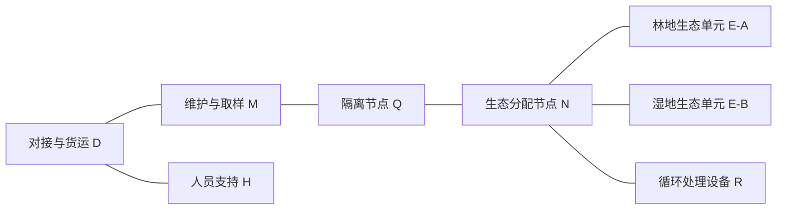

# 鸟船科研站结构草案

日期：2026-10-05。状态：功能与装配提案，供讨论；尚未确定尺寸、运载工具或详细外形。

进展与决策状态见 [设计进展记录](./torifune-design-progress.md)。功能关系见 [科研站功能连接示意](./torifune-functional-layout.svg)。该图只表达连接与分区，不代表尺寸、最终坐标或已批准外形。

## 设计依据

已确认的方向：

- 科研站，以封闭生态实验为主要任务；人员阶段性进驻是当前工作提案，具体周期和人数未定。
- 位于地月拉格朗日点附近，地球、月球、空间站都进入首页画面，天体视大小允许艺术放大。
- 人工重力采用虚构黑箱技术，不采用大型旋转环。
- 外部桁架、推进剂贮箱与推进器应有明确功能和可读结构。
- 首轮体块设计采用 A：纵向主梁 + 错位生态单元；B 紧凑分叉方案保留为备选。
- 先确定组成、连接与装配过程；本轮不生成图像，也不修改 Three.js 或正式网站。

原作约束来自《鸟船遗迹》附带故事：有限空间内的生态系统实验服务于地球环境改造；事故失控后，由仍可工作的推进系统自动转移；内部有森林、流水、动物、神社与不稳定人工重力。具体外形、尺寸、重力机制和发动机类型未指定。

来源：[THBWiki 收录的日文原文与中文译文](https://thbwiki.cc/鸟船遗迹/附带故事)。以下结构、组装地点和故障分区都是我们的设计提案。

## 1. 功能组成

| 编号 | 组件 | 具体内容 | 安装与检修原则 |
| --- | --- | --- | --- |
| D | 对接与货运作业舱 | 载人/货运接口、卸货区、对接检查设备、暂存区 | 独立刚性压力舱；接近走廊不被展开设备遮挡；接收外部货物时可隔离 |
| H | 人员支持舱 | 短期住宿、食品、卫生、医疗、独立生命保障 | 从 D 进入；不依赖实验生态提供必需氧气、饮水和食物 |
| M | 维护与取样实验舱 | 站务操作、备件、样品处理、设备维修、数据记录 | 靠近对接区与隔离节点；样品封闭转移；重要设备保留搬运通道 |
| Q | 生态隔离节点 | 双门缓冲、清洁/去污设备、环境检测、隔离控制 | 人员和材料进入生态区的必经边界；设定双门互锁与样品传递口 |
| N | 生态分配节点 | 生态舱入口、循环管路汇接、分区阀、电力和数据分配 | 独立可关断接口；节点可以暴露给某一区的环境，但不直接开放到人员区 |
| E-A | 林地生态单元 | 植被、树木、基质、动物活动空间、受控照明、局部水循环、神社位置 | 对外是可封闭压力单元；内部保留可步行通道与局部树高空间；重力设备嵌在服务层 |
| E-B | 湿地/循环生态单元 | 浅水、藻类、微生物和植物实验区；与 E-A 构成系统级实验 | 可单独调节与隔离；水和培养物单独运输，在轨分阶段投入；最终实验内容待确认 |
| R | 循环处理设备舱 | 水处理、气体处理、废物处理、储液、过滤及反应器 | 流体上直接服务 E-A/E-B；维护面朝向隔离后的生态服务区；非载人生态装置可设独立容器 |
| G-A/B | 重力设备组 | 黑箱发生器、驱动设备、分区控制、监测和维护接口 | 分别服务生态单元；接入供电、排热与检修通道；不据此虚构免费能源或无限作用范围 |
| T | 主桁架与安装结构 | 标准梁段、舱体安装座、外部平台、机械臂底座、线缆/管路托架 | 舱体在地面具有自己的压力结构；桁架承接安装和转移载荷，连接到设计好的承力接口 |
| W | 能源与热控组件 | 光伏翼、电池、配电、泵组、冷却回路、散热器 | 分批扩容；翼面在到位后展开；各冷却分支和供电分区可隔离 |
| P | 推进与安全飞控组件 | 主推进、姿态喷嘴、导航、冗余飞控、推进剂贮箱、阀组和供给管 | 可在生态实验未启动时自主工作；喷流避让舱体和展开设备；推力线根据组装后质心校准 |

H、M 的规模受人员短期维护任务约束，不按大型常驻居住站设计。生态核心可以由多个压力模块组成，E-A/E-B 表示功能单元，不代表一枚火箭各送一整座巨大舱体。

## 2. 人员与物料通路

- D→H 是日常生活通路；D→M→Q→N 是进入生态实验的通路。
- E-A 与 E-B 不设置默认常开的直通门；动物、水、营养物质或气体跨区流动应有指定通道与关断能力。
- R 与生态单元之间的流体连接不沿人员生活舱绕行。
- 样品在 Q/M 的封闭传递设施中处理，不默认把生态区空气和生物带入人员区。
- 神社位于 E-A 的内部活动空间，是原作场景要求；外部不为它额外堆砌大型装饰。

## 3. 空间布局原则

当前选用 A：“纵向主梁 + 错位生态单元”。人员服务组位于服务端，生态分配节点连接沿梁错位侧挂的生态单元，外部设备保留独立安装位置。B 紧凑分叉布局作为备选。

1. D/H/M 聚在服务端，优先保证对接接近、货物搬运和人员撤离。
2. Q/N 位于服务区与生态区之间，形成可读的连接颈与隔离边界。
3. E-A/E-B 挂接到生态分配节点的不同方向，位置按压力舱尺寸与接口决定。第一轮可研究沿服务轴两侧错位安装，保留各自检修面。
4. R 靠近生态单元，在外部留下可以辨认的处理设备、保温储液容器和受保护的管线。
5. T 使用贯通主梁与少量横向支架承载各模块，不用整圈笼架包裹全部压力舱。
6. W 安装在专门支臂上，光伏翼与散热板分别获得必要朝向和活动空间。
7. P 安装在可把载荷送入主结构的位置。发动机数量、贮箱大小与安装端暂不锁定，需由总质量、转移路径、推进方式及喷流避让决定。

布局必须留下：对接接近通道、机械臂工作范围、阀箱维护面、过滤器等部件的抽取方向、废旧设备的临时存放位、太阳翼和散热器的展开包络。

## 4. 装配阶段

这些是功能达到可运行状态的阶段，不等同于火箭发射次数。单次载荷仍受运载能力、整流罩、接口与质量限制。

| 阶段 | 交付与装配内容 | 达到的运行状态 | 进入下一阶段前的检查 |
| --- | --- | --- | --- |
| A | 基础航控 P、最小能源 W、服务节点 D、初始主梁 T | 独立通信、姿态控制、基础供电；可接收后续组件 | 飞控、供电、接口、结构连接、通信；推进剂不能在装配任务前被规划耗尽 |
| B | H/M、机械臂或装配工具、隔离节点 Q、桁架扩展 | 支持短期驻留与主动装配 | 人员生命保障、撤离通路、搬运路径、机械臂覆盖 |
| C | N、未投放生物的 E-A/E-B 压力模块、G 设备 | 生态空间完成压力与环境调试 | 密封、重力分区、控制、消防、断电及冷却失效处置 |
| D | R、补充能源与散热、管路与传感器 | 各环境子系统可单独运行 | 流体密封、关断、污染控制、分段供电、排热能力 |
| E | 基质、设备内装、水、种子及后续动物载荷 | 分阶段建立与闭合生态循环 | 空载→水循环→植物→微生物/动物的渐进调试；具体投放顺序由生态方案确定 |
| F | 在轨实验与自主安全转移验证 | 进入长期科研运行 | 总质量/质心、展开设备构型、导航、推进剂储备、安全转移逻辑 |

近地轨道组装和调试是提案，非原作明示。不能把去往地月拉格朗日点当作免费迁移：推进、轨道、时间和能源预算要单独建立。原作的自动转移情节要求设计时已经预留对应能力。

## 5. 复杂外部结构的来源

- 主梁在舱组承力接口、推进平台和能源支臂之间形成实际载荷路径。
- 舱段连接处出现安装座、斜撑和局部加强结构；横梁数量从设备和维护需求推导。
- 管线在托架内分组敷设，湿管路采取保温、必要加热和关断措施；不追求每根管子都在外面裸露。
- 贮箱按用途区分：推进剂、人员保障气体、生态循环储液不能视为同一组装饰球罐。
- 推进剂贮箱与阀组组成可测试组件；其外露程度应由防护、热环境和检修需求确定。
- 机械臂、外部载荷架和设备抓取点来自分批建设、换件与回收任务。
- 外形上的不同年代与不同批次来自标准接口上的组件更新，压力结构与连接方式仍保持一致性。

## 6. 人工重力与故障设定

人工重力发生器是明确接受的虚构技术。它让生态空间保持固定，不引入旋转接头和大型旋转环；其覆盖范围、功耗、热负荷和故障表现还需要设定，不能按真实硬件宣称可行性。

建议只在实际需要的生态地面与工作人员活动区产生规定重力，预留稳定的过渡区与设备固定措施。各分区可调节，但不能默认把生物、水体和松散基质直接切换到无重力而不考虑后果。

建议采用三种控制职责：

1. 基础飞控与安全转移：导航、姿态、推进、必要能源管理。
2. 站务保障：人员生命保障、舱压、基本热控与通信。
3. 科研生态管理：光照、环境实验、循环调节、生态重力分区与数据。

职责独立不代表没有依赖；共享电力、冷却与通信接口必须有故障边界。为了容纳原作情节，可以设定科研管理失联/异常后，独立安全飞控仍有足够电力、推进剂及有效导航完成预定转移。具体故障原因不在这份草案中定论。

## 7. 后续设计需要量化的内容

- 林地空间所需树高、可活动面积、水量、生态载荷及参与循环的物种范围。
- 功能单元采用的压力模块数量、尺寸与连接方式；是否需要可展开舱。
- 人员维护周期与驻留规模，决定 H/M 和对接能力。
- 植物照明、循环设备、人工重力、电推进（若选用）的电力与排热预算。
- 总质量、转移路径、推进方式、质量分布和推进剂储备。
- 原作背景的地月特洛伊群与最终选择的 L 点；首页天体显示仍可艺术放大。

本轮不填未经推算的吨数、功率、总长、发射次数或发动机尺寸。下一张图应首先是舱段拓扑与组装阶段的简单结构图，然后才是外形体块。

## 8. 科研任务与实验分区细化

研究对象是有限空间内的生态循环及其长期变化。人员区提供操作、维护和取样能力，生态区承担主要任务。

### 8.1 需要记录的量

| 研究问题 | 观察对象与记录 | 对空间的要求 |
| --- | --- | --- |
| 气体循环是否长期维持 | 各舱氧气、二氧化碳、湿度、温度及处理设备运行记录 | 传感器分布到舱段与循环接口；保留校准、换件与取样位置 |
| 水与营养物质是否稳定循环 | 储量、流量、水质、投入与取出记录、处理装置状态 | 收集、回流和处理路径可检查；局部关断时保留明确的隔离容积 |
| 生物群落如何变化 | 生长、死亡、种群变化、影像、样品、人工干预历史 | 固定观测点和可重复取样位置；维护人员进入要被记录 |
| 重力变化会带来什么影响 | 实际重力监测、设定变化、相同对象的培养与状态记录 | 主生态区保留稳定基线；局部研究使用有边界的可控实验容器 |
| 失去人工干预后发生什么 | 独立记录系统、维护日志、自动控制动作与状态变化 | 记录与基础监测有保持能力；不能把事故中的多重变化当作单变量实验 |

这不是已完成的生态实验方法学。阈值、物种、取样频率、干预规则和具体科研指标仍需根据实验范围选择。

### 8.2 主生态系统与对照实验

- E-A 林地和 E-B 湿地是当前主生态系统的功能分区。若共享水、气体或营养循环，它们就不是独立重复样本，也不是直接互为对照。
- 主系统的森林、水体和神社内部场景用于满足原作及探索空间；其稳定运行不要求每一处都能独立变更实验条件。
- 局部对照先按 M 内的小型密封培养容器提案：同类对象、可记录条件、独立控制与封闭取样。是否扩展到独立对照生态舱，应由研究任务决定。
- 人工重力先为主生态区提供可监测的基线；局部重力实验在专门边界内进行，避免整个森林或水体被频繁改变重力。

### 8.3 生态单元的三层空间

| 空间层 | 内容 | 维护方式 |
| --- | --- | --- |
| 生物活动空间 | 林地、动物、水体、基质、原作中的神社 | 保留指定步行/观察路径，进入行为需要记录；不以遍布维护设备的走廊替代生态空间 |
| 技术服务空间 | 集排水、管路、灯具电源、传感器接口、重力设备与局部控制 | 服务夹层或侧向检修带；选择实际能抽取、拆换和搬运的设备布置 |
| 压力与防护边界 | 压力壳、舱门、观察窗、外部防护与安装节点 | 地面制造与测试；外部检查通过机械臂和指定抓取/作业点完成 |

夹层位置必须考虑重力方向、水的收集方式和压力舱截面。不能在生态地面铺满设备后仍默认拥有完整树高空间，也不能让人工重力设备的维护只能从树根下面进行。

## 9. 接口与可独立交付的组件

功能编号与发射件之间采用多对多关系。第一轮组件划分如下，均为提案：

| 组件类型 | 包含的职责 | 地面交付时应完成的工作 | 在轨连接工作 |
| --- | --- | --- | --- |
| 基础服务平台 | P 的安全飞控、必要 W、T 初始段 | 飞控、能源与推进接口可独立测试；明确展开/未展开构型 | 后续主梁、服务舱和设备组件连接 |
| 刚性服务舱及节点 | D/H/M/Q/N，可由不同压力模块承担 | 压力壳、内部机架、舱门、气密接口、线缆与连接点集成 | 对接/停靠连接、密封确认、跨舱电气与流体接口连接 |
| 生态压力模块 | E-A/E-B 的一部分或整体 | 压力与防护结构、舱门、内部设备安装点、重力设备接口测试 | 结构连接、环境调试，再投入水、基质、生物与可运输内装 |
| 循环处理组件 | R 的处理装置与储液、阀组 | 分组设备、维护面、可替换件与隔离容积明确 | 连接生态接口、独立调试各循环分支 |
| 非加压设备组件 | T/W 外部平台、能源翼、散热器、机械臂 | 折叠包络、连接件、抓取点、运行/维护测试 | 安装、必要服务接口连接、展开与检查 |
| 推进剂及推进组件 | P 的贮箱、阀组、供给管与喷嘴 | 类型、供给、热管理、测试与运输构型明确 | 固定到承力接口；供给连接及验证；依据实际构型更新航控模型 |

### 9.1 四类接口要分别识别

1. **结构接口**：承担舱体、贮箱、设备和转移时的载荷；不把流体管路当作承力件。
2. **人员/气密接口**：决定可通行空间、舱门及隔离边界；气密连接不能由外部桁架替代。
3. **流体与热控接口**：实验介质、人员保障介质、冷却介质分别标识，设置关断和维护路径。
4. **电力与数据接口**：区分基本保障与科研负载，明确失联、断电、换件时的状态。

### 9.2 装配布局的评审问题

- 后装模块能否被机械臂送到安装位，而不穿过已展开的太阳翼？
- 压力舱能否对接、确认密封，再连接服务接口？接口是否可达？
- 贮箱与循环装置的换件需要多大通道？拆下的设备临时放在哪里？
- 生态舱隔离后，工作人员能否仍然安全撤离到 D/H？
- 发动机喷流、散热器视野和光伏翼转动/展开空间是否互相侵占？
- 新增生态载荷后，电力、排热、质心和安全转移余量是否仍可满足任务？

## 10. 结构体块的下一轮输入

体块草图应先画 D/H/M 服务组、Q/N 连接节点、E-A/E-B 压力空间、R 服务设备与 T/W/P 外部设备的轮廓与连接，保留装配、喷流、展开和维护包络。舱段形状、长宽和材料细节尚未定稿。

科研优先对应的外形层级是：生态空间占主要压力容积；服务舱组紧凑；循环与维护设备可辨认；外部桁架由实际安装节点展开；能源、散热与推进组件有各自运行空间。这里的层级不等同于未经计算的质量或体积比例。

### 10.1 生态空间高度工作范围

用户提出生态空间高度可能为 5–10 米，约 10 米作为当前设想的上限。这里暂解释为**基质表面/可步行地面到舱顶内侧的局部净高**，不视为已确定的外部尺寸，也不表示整个地板范围内都具有相同净高。

- 比较布局时暂采用 8 米净高作为工作值，非定稿尺寸。
- 5 米作为紧凑方案，检查低矮植被、较小树木、观察通路与设备维护是否能共存。
- 10 米作为上限方案，检查更高植被和多层空间是否值得增加舱容及相关系统需求。
- 树木高度要小于可用净高，保留照明、通风、传感与顶部检修空间。
- 基质、根系、水槽和底部服务空间另行计算；设备服务带可以沿侧面安排，不默认全部压在生态地面下。
- 压力壳、防护、隔热、安装座和外部桁架另占空间，生态净高不能直接标作舱体外径。
- 若采用圆筒压力舱，最高点净高与靠近侧壁的净高不同；体块方案应显示地面位置、可用宽度及树高包络。

下一轮先固定这一高度范围比较布局，长度、宽度和生态面积继续作为提案。刚性整体发射、可展开空间或其他压力结构路线尚未选定；5–10 米净高不自动证明能用某一种运载工具整体发射。

## 11. 首轮截面与体块布局比较

可编辑图：

- [生态舱截面几何试算](./torifune-ecology-section.svg)
- [两种体块布局比较](./torifune-layout-comparison.svg)

这些图由坐标与几何关系直接绘制。截面具有试算比例；整站布局只显示功能占位、候选连接和应保留的操作空间，不具备最终尺寸比例。两者均不是承压设计或已选定发射构型。

### 11.1 8 米净高的一个圆筒候选

采用内半径 5 米、地面位于圆心下方 3 米的截面：

- 压力边界内径为 10 米。
- 地面到内壁最高点为 `5 - (-3) = 8` 米。
- 地面弦宽为 `2 × sqrt(5² - 3²) = 8` 米。
- 地面以下中央最深处为 2 米，向侧面逐渐缩小，不能当成整层 2 米高的走廊。
- 暂留中央约 5 米宽、4–6 米高的植被包络；两侧各约 0.8 米通路，剩余约 1.4 米用于边界间距、护栏及局部接口。这些是占位提案，并非通行或生态设计定稿。
- 基质层图示约 0.85 米，底部示意局部储液及设备空间；实际根系、水量、结构与质量仍需确定。
- 重力设备优先放在从侧向检修带可达的位置，不依赖掀开整个林地地面维护。
- 压力壳、防护、隔热、安装座位于 10 米内径之外。图中外圈虚线仅表示未定外部包络，间距不表示壳厚。

保持同一截面比例进行比较，会得到下表。这只是几何缩放，不代表三种方案都已具备工程可行性：

| 最高点净高 | 压力边界内径 | 地面弦宽 | 地面以下最大深度 |
| --- | --- | --- | --- |
| 5 米 | 6.25 米 | 5 米 | 1.25 米 |
| 8 米 | 10 米 | 8 米 | 2 米 |
| 10 米 | 12.5 米 | 10 米 | 2.5 米 |

由此可见，8–10 米净高在这个圆筒候选里已经指向较大的压力空间。是否整体发射、展开形成或改变截面/模块组合，是下一步需要选择的路线；不能仅用黑箱重力解决运输与压力结构问题。

### 11.2 用相同功能组比较布局

| 比较项 | A：纵向主梁 + 错位生态单元 | B：紧凑服务核心 + 分叉生态单元 |
| --- | --- | --- |
| 舱段组织 | 服务区在主梁一端，生态单元沿梁不同位置侧挂 | 服务与隔离分配节点集中，生态单元从核心不同方向接入 |
| 扩建与装配 | 有机会逐段延长主梁、从相对开放的侧面安装；仍需逐项检查机械臂覆盖 | 接口集中，后续模块接近核心时更容易被已有设备和展开翼阻挡 |
| 通行与循环 | 通路、流体和电缆较长；必须留检修路径并分段关断 | 接口与处理设备可更集中；节点附近通行、管路与设备维护更拥挤 |
| 外部结构 | 纵梁、舱体安装座、横向支架、维护轨道更容易分别识别 | 核心连接结构与各分支支撑成为重点，不能用交叉连杆遮住作业位 |
| 维护与换件 | 留不同侧面的设备抽取和安装位置；换件可能要先收拢板翼 | 重点检查核心附近的阀箱、隔离门、样品和换件路径是否冲突 |
| 推进与展开 | 暂把推进平台放到主梁的开放端，质心、推力线与喷流仍需校准 | 紧凑核心不自动意味着推力通过质心；大型分支和水载荷需要纳入计算 |
| 第一轮用途 | 用户已选用，作为首轮体块设计基线 | 保留为连接紧凑性及差异轮廓的备选 |

用户已选择先用 A，下一轮沿此布局开展体块设计与装配检查。这项选择不代表已确定压力舱制造/运输方式、最终舱数、尺寸、推力线或动力预算，也不代表已证明其工程上优于 B。两方案都保留 P/W/T 的独立职责和科研功能组。

图上橙色区域为需要保留的操作空间提示，范围和角度尚未计算。太阳翼展开、散热器转动/视野、机械臂覆盖、搬运路径及喷流包络必须在选定真实体块尺寸后再次校准。

## 12. 独立 A 布局灰色体块

独立查看器位于 [experiments/station](../../experiments/station/README.md)，默认展示 A / 19。正式网站未接入，旧双环代码保留为历史参考；当前模型用于布局与局部外观评审，尚未完成整体外观和制造方案。

### 12.1 空间组织

- 服务组放在主梁一端；Q/N 接入沿轴线的压力通路，分支连接错位侧挂的 E-A/E-B。
- R 位于通路上方，经简化竖向接口连接；人员攀行、隔离、检修和内部设备未建模。
- 主梁设上下纵梁、横框与多面斜撑；生态单元通过横向空间桁架和安装座接入。
- 推进段独立扩大，包含贮箱与支座、供给设备平台、推力框、发动机和喷口占位。
- 双侧光伏翼位于独立支臂，双侧散热器靠近推进服务段；展开、维护与喷流避让候选包络可显示。
- 模型站体不旋转，保留地球、月球和星空背景用于观察整体尺度。功能标签与 10 米参考尺用于评审。

### 12.2 当前几何工作值

| 部分 | 工作值 | 含义与限制 |
| --- | --- | --- |
| 生态内部截面 | 10 米内径，最高点净高 8 米 | 来自截面候选，不表示实际压力结构已确定 |
| 生态外部包络 | 10.8 米直径 | 占位尺寸；内外径差不能当作已设计壳厚 |
| 林地/湿地筒段 | 14/9 米 | 不含简化封头；生态面积、内容与舱体运输未定 |
| 主桁架 | 64 米 | A / 02 布局工作值，含推进段增长后的安装位置 |
| 贮箱占位 | 4 个；直径 4.6 米，直筒段 5.6 米 | 不预设具体推进剂，也不把等尺寸贮箱认作已计算的组分比例 |
| 光伏翼 | 2×12×24 米，合计 576 平方米平面包络 | 不等于有效电池面积；功率取决于电池、姿态、温度、退化和运行工况 |
| 散热器 | 2×8×10 米 | 平面占位，热回路、温度、视野与热负荷未计算 |

### 12.3 大变轨的下一轮预算

用户要求推进段明确体现大变轨任务；A / 02 先扩大组件包络。大喷口不是足够变轨能力的证明，不能由外形直接给出推力或能量。

需要分别确定：

1. 空载结构、生态基质/水、设备、推进剂等质量与质心。
2. 转移起点、终点、时间、目标速度增量及余量。
3. 推进方式、比冲、推力与供给系统；比冲和推力不可混为同一指标。
4. 推进剂质量及组分体积、贮箱压力/温度、防护与支持结构。
5. 若采用电推进，其持续电力、时间和排热要求；当前未选择电推进。
6. 科研照明、循环、人员保障、黑箱重力及推进的并发/分时负载。

可用理想火箭方程建立第一轮质量关系：`Δv = g₀ Isp ln(m₀/mf)`。在选择具体推进路线和给出质量之前，本稿不填速度增量或燃料储备“足够”的结论。参考：[NASA 理想火箭方程](https://www1.grc.nasa.gov/beginners-guide-to-aeronautics/ideal-rocket-equation/)。

能源系统可参考深空设施把能源与推进作为独立服务能力的做法，但本模型不沿用其功率额定值。参考：[NASA Gateway 能源与推进组件](https://www.nasa.gov/reference/gateway-about/)。

## 工程参考

- [NASA：空间站组装部件](https://www.nasa.gov/international-space-station/international-space-station-assembly-elements/)：压力舱、桁架、外部平台、机械臂和能源阵列的分项组装。
- [NASA：空间站在轨建设](https://www.nasa.gov/history/iss20th-high-flying-construction/)：早期服务能力与后续机械臂、桁架、研究舱的分阶段建设。
- [ESA：MELiSSA 循环舱室](https://www.esa.int/Enabling_Support/Space_Engineering_Technology/Melissa/Closed_Loop_Compartments)：不同生态处理过程的功能分区。

这些资料支持部件分工与装配思路，不证明这座虚构设施的整体工程参数。

## A / 03 推进设备细化

用户确认采用可储存双组元化学主发动机与小型姿控推进方向。双主发动机和四个大型贮箱沿用 A / 02 工作占位，不据此外形推算性能。具体推进剂组合、供给方式（挤压或泵供）、混合比、推力、比冲及转移时长待定。

- 发动机从单独喷管扩展为喷注端、燃烧室外壳、安装环与喷管；没有模拟内部冷却通道或点火过程。
- 开放推力框连接推进平台与主桁架；独立薄隔热屏置于贮箱侧，避免将隔热件当成主承力件。结构载荷和热防护厚度尚无计算。
- 双路供给干线、分支阀块和两只增压气瓶展示功能关系；尚未确定气体种类、工作压力、调压回路或冗余方案。气瓶不代表已经选择挤压供给。
- 前后各两组姿控组件，每组暂设横向、上下及轴向喷嘴，以呈现空间分布与力臂。16 个喷嘴为建模占位，喷流与板翼、舱体的避让需继续校准，现有操作包络只描述主发动机尾向避让。
- 保持停用状态，不增加持续喷焰。灰色模型用于分辨设备和承力路径，尚未进入最终表面美术。

### A / 04 主喷嘴外形

沿用双化学主发动机和现有出口直径/轴向包络，改为喉部快速扩张、出口侧逐渐放缓的平滑钟形轮廓。上段夹套与延伸段通过接缝区分，上段加入细纵向加强纹，出口使用薄加强边，内壁独立使用深色材料。加强纹不视作已设计的冷却通道；曲线、接缝、材料色和内外壁间距均为美术工作值，没有由此确定膨胀比、温度或制造工艺。

## A / 05 对接与货运节点

用户确认前端人员主接口与侧向货运接口布局，暂不绑定来访飞船型号或对接标准。

- 人员接口面朝 −X，工作捕获面位于（−26.15, −1.4, 0）；前室接入服务组，人员进入 H/M，再经 Q/N 访问生态区。
- 货运接口面朝 +Z，工作捕获面位于（−20, −1.4, 7.95）；侧向检查/暂存舱采用直径 3.2 米、直筒段 3.7 米占位，独立托架接回主结构。货物先检查与暂存，经服务组转运，再通过 Q 进入生态区，不直接穿入生态舱。内部隔断、开口和搬运设备未建模。
- 两接口均增加捕获环、背部连接环、导向块、锁紧组件、凹入的关闭舱门与被动导向标记；环尺寸相同只是当前通用建模工作值，不意味着已选择兼容标准。传感器外壳不代表已设计导航系统。
- 操作包络新增前向人员与侧向货运两条接近区域。前向包络缩窄，以避开现有前端姿控组件；来访飞船外廓、太阳能翼、姿控喷流和停靠期间操作限制尚需核算。包络只是静态空间占位，没有碰撞检测或交会轨迹仿真。
- 主推进段和对接端分开；这不能替代对停靠构型下的结构载荷、质心与喷流分析。

## 机械臂准备方案（移动底座路线已确认）

目标是装配、货物/备件搬运、外部检查与设备换装；不默认由一支机械臂承担整座生态舱的搬运。当前短折叠臂仍是占位，不具备整站覆盖。

建议采用一支约 12–14 米展开尺度的关节主臂，配主桁架外侧移动底座。两段主要臂杆、肩部多轴关节、肘部和腕部姿态关节构成可折叠结构；末端抓取头与设备上的标准抓取点配套，末端附近设置相机和照明占位。长度仅用于覆盖研究，不指定载荷、精度或驱动性能。

移动轨道宜放在主桁架 +Z 外侧，与已有服务轨道分工；需先逐项检查货运舱托架、湿地支撑和板翼支臂是否阻断路径。轨道不得默认连续贯通，必要时保留分段停靠位。停放位候选为 Q/N 下方、原维护平台附近，折叠后沿 X 方向贴主梁收拢，不侵入对接接近区域。

首稿重点是服务组和生态舱设备侧的覆盖：货运物资转接点、设备托盘、生态舱外部检修点；推进段检查可作为远端停车位的后续覆盖目标，不承诺一支臂能绕过所有板翼及支撑。抓取点应安装在明确承力接口上，货物从对接舱内部转运至舱外的路径未确定前，不假设隔着压力壳即可被机械臂取出。

外观采用细长分段臂杆、明显关节壳体、局部线缆护罩与少量识别标记。首稿展示静态半展开姿态和折叠包络，先不添加自动抓取、逆运动学或循环摆动。轨道覆盖和关节运动包络需在模型上检查。

替代方案：固定底座更简单，但覆盖局部；依靠双端抓取头换基座可跨越部分障碍，但要求更多安装点和操作设计。用户已确认移动底座方案，A / 06 以静态半展开姿态实施。参考：[加拿大航天局移动底座](https://www.asc-csa.gc.ca/eng/iss/mobile-base/)、[ESA 欧洲机械臂](https://www.esa.int/Science_Exploration/Human_and_Robotic_Exploration/International_Space_Station/European_Robotic_Arm)。

### A / 06 移动机械臂首稿

- 沿主桁架 +Z 外侧设置约 40 米双轨（X −24 至 +16），轨面 Y −9.5，低于横向支撑底部。安装支架向下接回主梁，轨道沿线有止挡与停靠标记。现有上部服务轨道保留用途，不与移动底座共用。
- 当前底座 X −9，主臂两段关节中心长度约 6.72 / 5.82 米，连末端头部外形约 13.5 米。以肩部、肘部、腕部和末端滚转壳体呈现关节关系，不据此宣称已实现完整运动学。
- 首稿半展开，具备浅色臂杆、深色关节、识别端盖、局部线缆护罩、三指抓取头及相机照明占位。未增加循环摆动或轨道控制交互。
- 增加舱外设备托盘及其抓取点，生态舱承力安装座上也有抓取点；不在压力壳上任意贴装承力抓手。货物如何从货运检查舱转出仍待进一步设计。
- 操作包络加入候选折叠停放空间。当前仅显示半展开实体，折叠形态、轨道全程运动、关节限位、自碰撞、板翼避让与抓取姿态未验证，首稿不代表全站可达或载荷合格。

### A / 07 生态舱遮挡修正

A / 06 的下方轨道可供底座运输，但无法据此宣称机械臂能绕过生态舱到达上部和远侧。用户确认保留运输轨道、增加生态舱外侧检修基座及双端转接结构。

- 林地与湿地各有一座外侧检修基座，通过舱体下方的原支撑延伸桁架承接，分别位于 X −5.5 / +6.9、Z −16.7 / +16.7。不将基座直接贴装在压力壳表面。
- 当前主臂从湿地外侧基座半展开，臂杆和工具处于舱体外侧，避免展示穿过湿地舱的作业姿态；下方移动底座保留，当前不挂臂。
- 双端抓取头可表达交替固定与换基座功能，另在林地前方、主梁下侧增加中间转接基座（−11, −8.5, −5.5），作为从运输轨道转向林地侧的候选路线。相邻基座距离仅是初步布置依据，不代表完整无碰撞运动路径已验证。
- 操作包络分别展示林地、湿地外侧候选工作区与轨道折叠区，不能解释为所有位置可达。主臂仍为静态模型，换位过程、关节限位、线缆/供电接口、载荷和停靠精度未实现或核算。

### A / 08 双机械臂分工

用户要求同时设置两支机械臂，使下方轨道用途可直接辨认。首稿采用相同规格的两支臂，不引入第三支臂：运输装配臂固定在当前移动底座上，姿态朝向开放服务区；检修臂固定在湿地外侧基座。两臂分别静态展示，轨道运动与抓取动作仍未实现。

检修臂换基座设想为双端交替抓取：空闲端抓住兼容基座，确认锁定与必要供电/数据连接后，释放原固定端；无需航天员拆装整臂。但当前模型只具备基座与双端抓取头外形，尚未实现锁定、线缆或交替换位，也未验证到林地基座的运动路径。林地与湿地基座不等同于已经实现两舱连续全覆盖。

运输臂用于服务区、设备托盘与下方可达设备的搬运装配；不再把下方轨道解释为空置的主臂备用路线。是否需要不同工具或载荷等级，待任务和预算确定。

A / 08 外观补充：运输装配臂绕底座转向服务/货运一侧，与外侧检修臂采用不同伸展方向；运输臂杆使用灰蓝涂装，检修臂保留浅色涂装，两者仍共用关节和抓取接口设计。

## A / 09 对地通信主天线

用户要求以大天线作为通信与导航模块的视觉重点，传感器和观测设备以少量次要小件呈现。现有双机械臂与换位基座保持 A / 08 方案，不按曾提出的双轨永久固定方案修改。

- 服务组上方设置口径暂取 7.2 米的主反射面，采用抛物面几何；焦距 2.5 米是建模工作值，不由此赋予频段、增益或通信能力。
- 碟面以浅色内表面、较暗背面、薄边框、十二道背部加强筋和中心安装毂构成。三根细支杆支撑馈源外形。
- 底座带方位轴、支柱与俯仰轴占位，通过舱体外侧支架接回主结构，不让支架穿越压力舱。当前固定姿态按画面选择，并非实时对地跟踪；轨道位置与站体姿态确定后需校准指向、遮挡和扫掠空间。
- 少量导航传感器盒与对接相机补充服务区及推进端轮廓，不宣称实现了完整观测、冗余或制导系统。
- 尚未计算通信链路、天线质量、驱动负荷、展开方式、热环境或失联故障。尺寸和天线外形均为可调整美术工作值。

### A / 10 天线间隙与对地指向

用户要求修正天线穿模并校准方向。固定支柱抬高，转动枢轴由原先附近位置移至（−20, 7.2, −3）；碟面、馈源及背部支撑组成独立转动组，固定底座与支柱保持不动。碟面顶点与枢轴留 0.45 米工作偏置，使中心安装毂位于碟面背侧。

查看器在地球背景布局后，按地球中心相对天线枢轴的位置计算开口轴线；窄屏和窗口尺寸更新时同步校准。不再使用为构图写死的朝向，默认视角可能看到碟面背侧。该指向对齐当前艺术场景，不代表真实地月轨道、地面站跟踪或机构转动限位已经建模。

当前检查包括桌面/手机静态截图与开口轴线对齐、天线包络高度的数值检查；尚未做完整转动扫掠、结构载荷与机械臂碰撞分析。

## A / 11 生态舱外壳与局部观察窗

用户同意细化生态舱，并提出需要玻璃以帮助观众理解功能。首稿采用局部带框观察窗，大部分外壳保持实体，不采用全玻璃舱。窗口区域在壳体几何中实际留空，避免将透明材料叠在完整实心壳上。

- 林地观察带暂长 8 米、分三格；湿地暂长 5 米、分两格。窗口位于朝向当前主镜头的侧面，弧面角宽为美术工作值，不是已通过压力或微流星体防护设计的可制造结构。
- 壳体增加端部接缝、局部防护板和窗口两侧检修设备盒/管路。大部分表面保留实体，后续需要确认保温、防护、观察窗遮盖和应急封闭设计。
- 观察窗内放置简化林木、基质、步道、水面和湿地植被，仅服务视觉辨识，不完成物种、生态面积、人工照明或循环设计。
- 玻璃颜色、透明度与框架尺寸按渲染调试；没有把窗口厚度作为压力设计结果。当前不新增透明整舱、完整内部场景或额外交互。

A / 10 天线修正的独立构建成功，桌面/手机截图已查看；轴线对齐值约 1，天线包络最低高度分别约 1.47 / 2.23 米，高于服务舱最高点 0.7 米。这是当前两种布局姿态的间隙检查，不是全转角扫掠验证。

### A / 12 外壳材质与分块

用户要求改善各舱段光滑白色的外壳。生态舱采用偏灰的壳底与浅灰防护板，观察窗所在弧面保持开口，外部防护板以轴向和周向分块、细缝区分；服务舱采用灰蓝面板，循环/隔离设备采用较暗灰蓝外壳。

贮箱独立采用偏暖金属材质和较高金属度，保留结构绑带，部分面板与端部检修盖区分。小型气瓶和生态舱局部防护区采用少量低饱和隔热层色。端部增加检修盖、锁紧件与连接圈。

这些颜色、面板缝、表面粗糙度、金属度和检修盖尺寸为美术工作值，不代表已确定压力壳、隔热材料或制造工艺。当前未增加大面积损伤或锈蚀，也不据此外观断言停用原因。

## A / 13 板翼、散热器与能源设备桁架

用户要求补充太阳能板和散热器，并参考 ISS 板翼附近的桁架增加立体结构。采用有上下纵梁、横框与多面斜撑的箱形空间桁架，不新增无用途的独立装饰杆。

- 双侧光伏翼维持各 12×24 米平面工作包络，分为四列六段。深色电池片纹理由本地 Canvas 生成，面板下有背板、边框、折叠接缝和铰链占位；下方有较轻的部署桁架。
- 根部增加转动环、另一轴向的根部关节与设备箱。能源桁架位于板翼与站体之间，较深的横截面承接局部电气设备、线缆和根部机构。固定内侧连接降低至贮箱下方，外侧桁架从贮箱侧边留出距离后展开。当前没有旋转或折叠动画。
- 散热器独立支撑，板面分五段，浅色辐射面、背部加强件、集流管与分支管路、根部设备盒和铰接占位与光伏翼区分。160 平方米仍是原工作包络，不由此赋予排热能力。
- 外形参考 ISS 桁架承载板翼、设备和散热器的组织关系；未照搬 ISS 尺寸、材料、机构、太阳跟踪方式或冷却介质。参考：[NASA 桁架](https://www.nasa.gov/international-space-station/integrated-truss-structure/)、[NASA 板翼转动机构介绍](https://www.nasa.gov/podcasts/houston-we-have-a-podcast/station-solar-arrays)、[NASA 散热器研究](https://ntrs.nasa.gov/citations/20040073441)。
- 展开和转动全程的避障、载荷、光照阴影、电气和热控预算仍待核算；静态构图不能证明所有作业区畅通。

### A / 14 分散电气设备托盘

用户选择方案 1，撤下能源设备桁架中央的大柜体及棕色顶盖。每侧桁架改为三组交错侧挂的灰色托盘，附不同体量电气盒、盖板缝、散热鳍片、连接器和接入纵向线缆槽的短线束。托盘挂在桁架内侧安装点，中间留空以显露多面斜撑。

此调整保持板翼、散热器和根部转动机构的位置/尺寸；电气设备细节用于表现安装与检修关系，尚未给设备指定电气型号、额定功率、散热或冗余性能。

### A / 15 光伏与散热板指定轴向

太阳能翼保持 XZ 面、法线 Y；散热器整体绕 Z 轴转 90°，板面变为 YZ、法线沿 X。当前双侧散热器保持各 8×10 米工作包络，板面、框架、管路和铰接根部一起调整，固定支架保持原位并重新连接集流管。

此姿态以用户指定轴向为准，不代表 ISS 所有运行状态下都采用固定 90° 夹角。静态截图与构建已检查，全程避障、热视野、机构限位和结构载荷未验证。阶段性收工后的剩余工作见 [会话交接](./torifune-session-handoff.md)。

### 后续重点：舱段对接与组装痕迹（尚未建模）

用户提出后续应加强各舱段的对接和组装痕迹，改善部分结构像从头到尾一根光滑圆柱体的观感。先标出真实模块分界，在服务组、过渡通道、生态舱端部及循环设备处补连接环、锁紧件、短接口段、安装座、跨接口管线、检查口与分段外壳。永久装配连接、人员气密通道和来访飞船对接接口需按用途区分，不给每段圆柱体机械复制同一种对接环。当前只有初步接缝和端部盖板，此项尚未深化。

## A / 16 近未来材质与观察窗细化

本轮按用户选择实施外壳材质与观察窗细化，生态内部与循环套件延后。A 构型、双机械臂、推进体量和 A / 15 指定的光伏/散热轴向继续沿用。

- 防护板由无厚度曲面改为带侧缘与背面的薄曲板，外表面 UV 独立覆盖单块面板；共享本地生成的边缘/紧固件纹理。按带状分配浅灰、灰蓝涂装，局部保留色差。
- 哑光涂层、金属机构和隔热毯使用不同金属度/粗糙度；隔热毯增加褶皱凹凸、包边和固定片。颜色纹理使用 sRGB，粗糙度和高度纹理按线性数据处理。纹理由现有 materials.js 生成，沿用原有资源释放机制。
- 观察窗保留原开口与位置，增加密封边、深窗框、较窄金属压框及紧固件；上侧设置收起的四片防护盖与铰链、锁扣外形。盖板是静态建模占位，未验证覆盖严密性、铰链运动和扫掠间隙。
- 玻璃调整透明度、表面粗糙度和环境反射；透明窗单独保留以允许逐窗排序，并关闭投影与接影。其余静态零件实例化时保留原本的阴影设置。
- 薄板自阴影出现斜纹，经关闭阴影的临时截图对照确认；保留阴影并将主光阴影图改为 2048²、法线偏移改为 0.12，以匹配整站尺度和薄板细节。
- 原有窗旁设备盒增加盖板、锁扣及把手。生态植被、水面、照明、科研传感器、R 循环设备与窗口朝向均留待后续。

以上为外观与渲染改进，不据此指定真实材料牌号、压力窗结构、隔热性能或在轨维护能力。窗口防护外形参考 [ESA Cupola](https://www.esa.int/Science_Exploration/Human_and_Robotic_Exploration/Node-3_Cupola/Cupola)，未采用其尺寸或性能作为本模型依据。其余评估建议与暂缓项见 [会话交接](./torifune-session-handoff.md)。

## A / 17 桁架表面与节点

主梁、生态承托与横向能源桁架改用带小倒角的型材外形；独立银灰金属材质表达加工面反射，节点套接件使用较暗金属。主梁节点由原厚方块改为薄连接板与成对紧固件，斜撑略收细并增加端部套接外形。重复零件继续共享几何体/材质并实例化。布局、杆件连接拓扑、机械臂与板翼姿态保持原方案；截面和节点仍是外观工作值，未指定实际空心壁厚、材料牌号和承载能力。

## A / 18 开放推进设备架

用户确认撤去四个贮箱下方的整块设备平台占位。沿原有三组横向桁架补纵向连接、底部斜撑与到主梁下弦的短支柱；贮箱 V 形支座接入上层纵梁。发动机推力框根部改接一根有明确支承的横梁，继续保留发动机前方的独立薄隔热屏。

两侧各设两个独立供给设备托盘，分别承接阀组与局部设备箱，侧缘仅设置小片隔热挡片，托盘之间及下方保持开放。供给干线从与支座横杆重叠的位置下移并向外偏置，位于横杆下方、V 形托架内侧，支路接回贮箱出口和发动机阀组。贮箱、发动机、能源翼及散热器的工作位置和尺寸沿用。

新增杆件、设备架和管路用于展示连接关系，未指定实际承载、冗余回路、热防护指标或流体性能；静态截图不替代碰撞及载荷分析。

## A / 19 纵向承力骨架调整

用户选择将现有 A 构型调整为更明确的纵向骨架。侧视和端向投影见 [承力骨架关系图](./torifune-axial-spine.svg)，当前尺寸与迁移事项见 [会话交接](./torifune-session-handoff.md#a--19-纵向骨架与侧接舱段)。本轮沿用压力舱位置、功能连接、四贮箱/双发动机与板翼轴向，修改它们与主结构的连接方式。

服务及通道段采用位于压力通路外侧的矩形框架，货运与生态支路穿过留空跨间。骨架在循环设备区避开顶面横撑；端部压力舱通过候选加强环/安装点连接纵梁。生态舱接在骨架两侧，内侧短支杆连接端环，撤下连续舱底托架。端环表示需要压力壳设计配合的承力接口，不能把当前外部防护板视为可直接承载的壳体。

推进段收窄到贮箱之间，各罐通过环上内侧节点连接；原底部平台桁架撤下，小设备托盘改挂骨架。发动机推力框接到后段节点，隔热屏分片避让中央结构，管路从屏下通行。骨架上移后，运输轨道、机械臂基座、货运/天线/姿控及能源支臂的承接点一起更新，不保留指向旧底架的支杆。

当前图示为几何与装配关系研究。尚未把总质量、燃料消耗、水和基质分布纳入质心/惯量模型，不能据此断言推力线已通过质心或结构更轻。端环、纵梁截面、框架开口、轨道悬挂及臂端可达性仍需按后续工程约束核对。生态科研设备和循环套件继续暂缓。
